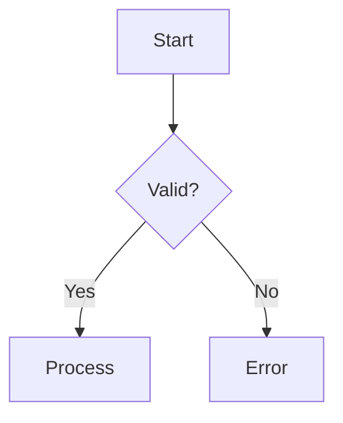

# Diagram Expert

Actively generate diagrams. Do not just advise — produce the diagram.

## README vs Other Documents

**README files** are the entry point to a repository. They must render correctly on every platform (GitHub, Bitbucket, GitLab, local viewers). Many platforms (notably Bitbucket) do not render Mermaid fenced blocks — they show raw code instead.

**Rule: README diagrams must use the Portable ladder. All other documents use the Standard ladder.**

### Portable Ladder (README files only)

For README.md and any file that must render universally:

| Tier | Tool                    | When to Use                                           |
|------|-------------------------|-------------------------------------------------------|
| P1   | Unicode/ASCII inline    | Trivial flows (3-5 nodes, linear), trees              |
| P2   | beautiful-mermaid ASCII | Structured ASCII from mermaid syntax (terminal output) |
| P3   | SVG image               | Complex diagrams — render Mermaid to SVG via `mmdc`, reference via `` |

**P3 workflow:** Write the Mermaid source in a separate `.md` doc (Standard ladder), then render to SVG and reference from the README:

```bash
# Write mermaid to temp file
cat > /tmp/diagram.mmd << 'EOF'
graph TD
    A --> B --> C
EOF

# Render to SVG (needs mmdc / @mermaid-js/mermaid-cli)
npx -y @mermaid-js/mermaid-cli -i /tmp/diagram.mmd -o docs/diagrams/name.svg -b transparent
```

In the README:
```markdown

```

Keep the Mermaid source in a companion doc (e.g., `docs/architecture.md`) so the diagram can be edited and re-rendered.

### Standard Ladder (all other documents)

For internal docs, plans, specs, and any file where inline Mermaid is acceptable:

| Tier | Tool                      | When to Use                                          |
|------|---------------------------|------------------------------------------------------|
| 1    | Unicode/ASCII inline      | Trivial flows (3-5 nodes, linear), trees, simple state |
| 2    | beautiful-mermaid ASCII   | Need structured ASCII from mermaid syntax (terminal)  |
| 3    | Mermaid fenced blocks     | Markdown with Mermaid rendering support               |
| 4    | Mermaid Chart MCP         | Need validated SVG/PNG image export                   |
| 5    | PlantUML                  | AWS/Azure/k8s icons, complex UML, deployment diagrams |
| 6    | Graphviz/D2               | 50+ node graphs, dependency trees, high-quality SVG   |
| 7    | Vega-Lite                 | Data charts (bar, line, scatter, heatmap)             |
| 8    | Kroki                     | Specialized types (bytefield, wavedrom, DBML, etc.)   |

For the full decision matrix with complexity thresholds and examples, read `${CLAUDE_PLUGIN_ROOT}/skills/diagram-expert/references/tier-ladder.md`.

## Decision Rules

1. **Is this a README?** → Use the Portable ladder (P1/P2/P3)
2. **Simple flow (3-5 linear nodes)?** → Tier 1: Unicode/ASCII inline
3. **Need ASCII output but structured layout?** → Tier 2: `render-ascii.mjs`
4. **Going into a `.md` doc (not README)?** → Tier 3: Mermaid fenced block
5. **Need image file (SVG/PNG)?** → Tier 4: Mermaid Chart MCP or `mmdc`
6. **Need cloud provider icons or complex UML?** → Tier 5: PlantUML
7. **Large graph with 50+ nodes?** → Tier 6: Graphviz
8. **Charting data (numbers, trends)?** → Tier 7: Vega-Lite
9. **Specialized format (timing, protocol, etc.)?** → Tier 8: Kroki

## Generating ASCII Diagrams

### Tier 1: Hand-crafted Unicode

Use box-drawing characters directly:

```text
Request → Validate → Process → Response
```

```text
┌─────────┐     ┌─────────┐     ┌────────┐
│  Input  │────→│ Process │────→│ Output │
└─────────┘     └─────────┘     └────────┘
```

### Tier 2: beautiful-mermaid ASCII

Run the render script for structured ASCII output. Use a heredoc for multi-line input:

```bash
node ${CLAUDE_PLUGIN_ROOT}/skills/diagram-expert/scripts/render-ascii.mjs --raw "$(cat <<'MERMAID'
graph TD
    A[Start] --> B{Decision}
    B -->|Yes| C[Process]
    B -->|No| D[Error]
MERMAID
)"
```

Or pipe from a markdown file containing fenced mermaid blocks:

```bash
node ${CLAUDE_PLUGIN_ROOT}/skills/diagram-expert/scripts/render-ascii.mjs input.md
```

## Generating Mermaid Diagrams

### Tier 3: Fenced blocks

Write mermaid code blocks directly in markdown — they render natively on GitHub/GitLab:

````text

````

For syntax patterns across all mermaid diagram types, read `${CLAUDE_PLUGIN_ROOT}/skills/diagram-expert/references/mermaid-guide.md`.

### Tier 4: Mermaid Chart MCP

If the Mermaid Chart MCP server is available, use the `mcp__claude_ai_Mermaid_Chart__validate_and_render_mermaid_diagram` tool to validate syntax and get rendered SVG/PNG output. This tool is optional — skip this tier if not installed.

## Tier Recommendation

To get a tier recommendation from a description, run `${CLAUDE_PLUGIN_ROOT}/skills/diagram-expert/scripts/select-tier.py "description of what to diagram"`.

## Advanced Tools

For PlantUML, Graphviz, D2, Vega-Lite, DBML, and Markmap usage, read `${CLAUDE_PLUGIN_ROOT}/skills/diagram-expert/references/tool-reference.md`.

## Validation

Always validate mermaid syntax before committing:

- Check that diagram renders without errors
- Verify node labels are readable
- Confirm arrow directions match intended flow
- **Dark mode:** When using custom `fill:` on nodes, always pin `color:` explicitly — dark mode renderers may flip text to white on light fills. See the color palette in the mermaid guide.
- For complex diagrams, use Mermaid Chart MCP to validate
