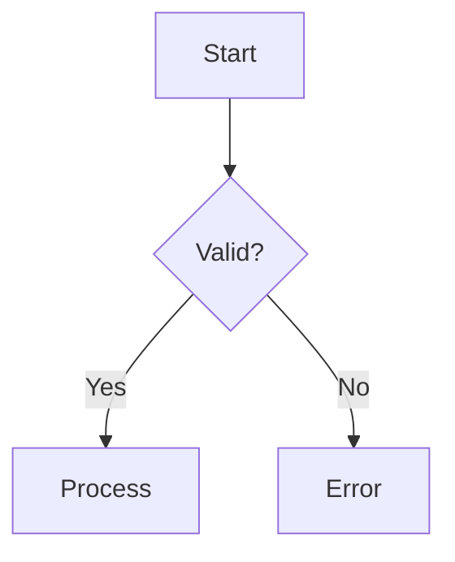
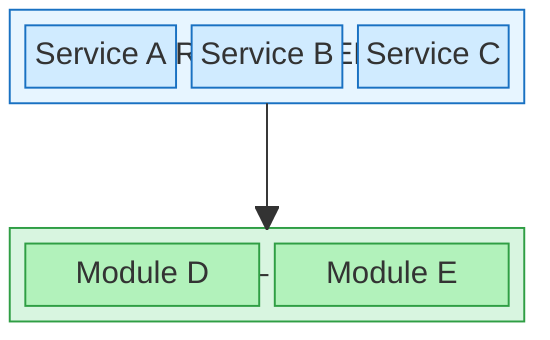

# Diagram Expert

Actively generate diagrams. Do not just advise — produce the diagram.

## README vs Other Documents

**README files** are the entry point to a repository. They must render correctly on every platform (GitHub, Bitbucket, GitLab, local viewers). Many platforms (notably Bitbucket) do not render Mermaid fenced blocks — they show raw code instead.

**Rule: README diagrams must use the Portable ladder. All other documents use the Standard ladder.**

### Portable Ladder (README files only)

For README.md and any file that must render universally:

| Tier | Tool                    | When to Use                                           |
|------|-------------------------|-------------------------------------------------------|
| P1   | Unicode/ASCII inline    | Trivial flows (3-5 nodes, linear), trees              |
| P2   | beautiful-mermaid ASCII | Structured ASCII from mermaid syntax (terminal output) |
| P3   | SVG image               | Complex diagrams — render Mermaid to SVG via `mmdc`, or generate native SVG via Python |

**P3 workflow:** Write the Mermaid source in a separate `.md` doc (Standard ladder), then render to SVG and reference from the README:

```bash
# Write mermaid to temp file
cat > /tmp/diagram.mmd << 'EOF'
graph TD
    A --> B --> C
EOF

# Render to SVG (needs mmdc / @mermaid-js/mermaid-cli)
npx -y @mermaid-js/mermaid-cli -i /tmp/diagram.mmd -o docs/diagrams/name.svg -b transparent
```

In the README:
```markdown

```

Keep the Mermaid source in a companion doc (e.g., `docs/architecture.md`) so the diagram can be edited and re-rendered.

### Standard Ladder (all other documents)

For internal docs, plans, specs, and any file where inline Mermaid is acceptable:

| Tier | Tool                      | When to Use                                          |
|------|---------------------------|------------------------------------------------------|
| 1    | Unicode/ASCII inline      | Trivial flows (3-5 nodes, linear), trees, simple state |
| 2    | beautiful-mermaid ASCII   | Need structured ASCII from mermaid syntax (terminal)  |
| 3    | Mermaid fenced blocks     | Markdown with Mermaid rendering support               |
| 4    | Mermaid Chart MCP         | Need validated SVG/PNG image export                   |
| 5    | Mermaid block-beta        | Layered/grid architecture diagrams with horizontal rows            |
| 5b   | Native SVG (Python)       | Pixel-precise layout, re-runnable generators, Mermaid can't handle |
| 6    | PlantUML                  | AWS/Azure/k8s icons, complex UML, deployment diagrams |
| 7    | Graphviz/D2               | 50+ node graphs, dependency trees, high-quality SVG   |
| 8    | Vega-Lite                 | Data charts (bar, line, scatter, heatmap)             |
| 9    | Kroki                     | Specialized types (bytefield, wavedrom, DBML, etc.)   |

For the full decision matrix with complexity thresholds and examples, read `${CLAUDE_PLUGIN_ROOT}/skills/diagram-expert/references/tier-ladder.md`.

## Decision Rules

1. **Is this a README?** → Use the Portable ladder (P1/P2/P3)
2. **Simple flow (3-5 linear nodes)?** → Tier 1: Unicode/ASCII inline
3. **Need ASCII output but structured layout?** → Tier 2: `render-ascii.mjs`
4. **Going into a `.md` doc (not README)?** → Tier 3: Mermaid fenced block
5. **Need image file (SVG/PNG)?** → Tier 4: Mermaid Chart MCP or `mmdc`
6. **Layered architecture with horizontal rows?** → Tier 5: Mermaid `block-beta` (use `columns` for grid layout)
6b. **Pixel-precise layout or re-runnable generator needed?** → Tier 5b: Native SVG (Python)
7. **Need cloud provider icons or complex UML?** → Tier 6: PlantUML
8. **Large graph with 50+ nodes?** → Tier 7: Graphviz
9. **Charting data (numbers, trends)?** → Tier 8: Vega-Lite
10. **Specialized format (timing, protocol, etc.)?** → Tier 9: Kroki

## Choosing the Right Mermaid Diagram Type

When Tier 3 (Mermaid fenced blocks) is selected, pick the diagram type that best fits the content:

| Content                              | Diagram Type     | Example                              |
|--------------------------------------|------------------|--------------------------------------|
| Steps, decisions, workflows          | `flowchart`      | Login flow, CI/CD pipeline           |
| API calls, request/response          | `sequenceDiagram`| Auth handshake, webhook flow         |
| Lifecycle, transitions               | `stateDiagram-v2`| Order status, connection states      |
| Tables, foreign keys                 | `erDiagram`      | Database schema                      |
| Inheritance, composition             | `classDiagram`   | OOP design, type hierarchy           |
| Layered architecture (grid)          | `block-beta`     | System layers, service groups        |
| Software architecture (C4)           | `C4Context`      | Context/container/component views    |
| Brainstorming, topic breakdown       | `mindmap`        | Feature planning, concept map        |
| Project schedule, phases             | `gantt`          | Sprint timeline, release plan        |
| Proportions, distribution            | `pie`            | Budget split, error breakdown        |
| Branching strategy, merge history    | `gitgraph`       | Git flow, release branches           |
| Events over time                     | `timeline`       | Project milestones, incident history |
| 2x2 analysis, priority/effort       | `quadrantChart`  | Feature prioritization               |
| Trend data, bar/line charts          | `xychart-beta`   | Revenue over time, metrics           |
| Flow quantities between nodes        | `sankey-beta`    | Budget flow, data pipeline volumes   |

For syntax details of each type, read `${CLAUDE_PLUGIN_ROOT}/skills/diagram-expert/references/mermaid-guide.md`.

## Generating ASCII Diagrams

### Tier 1: Hand-crafted Unicode

Use box-drawing characters directly:

```text
Request → Validate → Process → Response
```

```text
┌─────────┐     ┌─────────┐     ┌────────┐
│  Input  │────→│ Process │────→│ Output │
└─────────┘     └─────────┘     └────────┘
```

### Tier 2: beautiful-mermaid ASCII

Run the render script for structured ASCII output. Use a heredoc for multi-line input:

```bash
node ${CLAUDE_PLUGIN_ROOT}/skills/diagram-expert/scripts/render-ascii.mjs --raw "$(cat <<'MERMAID'
graph TD
    A[Start] --> B{Decision}
    B -->|Yes| C[Process]
    B -->|No| D[Error]
MERMAID
)"
```

Or pipe from a markdown file containing fenced mermaid blocks:

```bash
node ${CLAUDE_PLUGIN_ROOT}/skills/diagram-expert/scripts/render-ascii.mjs input.md
```

## Generating Mermaid Diagrams

### Tier 3: Fenced blocks

Write mermaid code blocks directly in markdown — they render natively on GitHub/GitLab:

````text

````

For syntax patterns across all mermaid diagram types, read `${CLAUDE_PLUGIN_ROOT}/skills/diagram-expert/references/mermaid-guide.md`.

### Tier 4: Mermaid Chart MCP

If the Mermaid Chart MCP server is available, use the `mcp__claude_ai_Mermaid_Chart__validate_and_render_mermaid_diagram` tool to validate syntax and get rendered SVG/PNG output. This tool is optional — skip this tier if not installed.

### Tier 5: Mermaid block-beta (layered/grid layouts)

Use `block-beta` with `columns` for horizontal layered architecture diagrams. This solves the problem where `flowchart` with `direction LR` inside subgraphs breaks (nodes stack vertically, labels truncate).

**Important:** Do NOT use `flowchart` with `direction LR` inside subgraphs for layered layouts — it is unreliable. Use `block-beta` instead.



**Key patterns:**

- `columns 1` at root level → layers stack vertically
- `columns N` inside each block → items sit side-by-side
- `space` between blocks → visual gap for arrows
- Block-to-block arrows (`layer1 --> layer2`) connect layers
- Per-item `style` directives for color coding

**Render to SVG:** `mmdc -i diagram.mmd -o diagram.svg -b transparent`

**Limitation:** Block titles (e.g., `block:name["Title"]`) may not render as visible labels in all Mermaid versions. If labels are needed, use Native SVG (Tier 5b) instead.

### Tier 5b: Native SVG (Python)

Generate SVG files directly using Python scripts with native SVG elements (`<rect>`, `<text>`, `<line>`, `<polygon>`). No external dependencies required.

**Use when:**

- **Mermaid `block-beta` isn't enough** — need visible layer labels, pixel-perfect spacing, or complex per-item styling
- **Re-runnable generator** — data-driven diagram that will be updated as the project evolves (script lives next to SVG)
- **Precise layout control** — exact positioning, consistent spacing, pixel-perfect alignment
- **No Mermaid dependency** — pure Python, zero npm/CLI tools needed

**Why not foreignObject SVG?** Embedding HTML/CSS inside SVG via `<foreignObject>` is fragile — flexbox, `<br>` tags, and complex layouts break across viewers (browsers, Bitbucket, GitHub). Native SVG primitives render everywhere.

**Try `block-beta` first (Tier 5).** Only drop to native SVG when Mermaid's output isn't sufficient.

**Pattern:** Write a Python generator script that outputs SVG, keep the script alongside the diagram for future updates:

```
docs/diagrams/
  gen-my-diagram.py          # editable source — re-run to update
  my-diagram.svg             # generated output — referenced from docs
```

**Template:**

```python
#!/usr/bin/env python3
"""Generate native SVG diagram."""
from pathlib import Path

elements = []

def esc(s):
    return s.replace("&", "&amp;").replace("<", "&lt;").replace(">", "&gt;")

def rect(x, y, w, h, fill, stroke, rx=10, dash=False):
    d = ' stroke-dasharray="8 4"' if dash else ""
    elements.append(
        f'<rect x="{x}" y="{y}" width="{w}" height="{h}" rx="{rx}" '
        f'fill="{fill}" stroke="{stroke}" stroke-width="1.5"{d}/>')

def text(x, y, lines, size=12, bold=False, color="#1e1e1e"):
    weight = "bold" if bold else "normal"
    for i, line in enumerate(lines):
        ly = y + i * (size + 4)
        elements.append(
            f'<text x="{x}" y="{ly}" font-family="Helvetica,Arial,sans-serif" '
            f'font-size="{size}" font-weight="{weight}" fill="{color}" '
            f'text-anchor="middle" dominant-baseline="middle">{esc(line)}</text>')

def arrow_down(x, y1, y2):
    elements.append(f'<line x1="{x}" y1="{y1}" x2="{x}" y2="{y2-6}" stroke="#adb5bd" stroke-width="2"/>')
    elements.append(f'<polygon points="{x-5},{y2-8} {x+5},{y2-8} {x},{y2}" fill="#adb5bd"/>')

# Build your diagram here using rect(), text(), arrow_down()
# ...

W, H = 1100, 800
svg = f'''<svg xmlns="http://www.w3.org/2000/svg" width="{W}" height="{H}" viewBox="0 0 {W} {H}">
<rect width="{W}" height="{H}" fill="#ffffff"/>
{"".join(elements)}
</svg>'''

out = Path(__file__).parent / "my-diagram.svg"
with open(out, "w") as f:
    f.write(svg)
print(f"Generated: {out}")
```

**Key rules:**

- Always XML-escape text content (`&` → `&amp;`, `<` → `&lt;`, `>` → `&gt;`)
- Use `font-family="Helvetica,Arial,sans-serif"` for cross-platform rendering
- Use `text-anchor="middle"` + `dominant-baseline="middle"` for centered text
- Validate output: `python3 -c "import xml.etree.ElementTree as ET; ET.parse('diagram.svg'); print('Valid')`
- Keep the generator script next to the SVG so it can be re-run
- For **dependency/relationship diagrams**: connect arrows to box side centers (not corners), route cross-row arrows through gutters via VHV elbows, stagger overlapping paths, and export to PNG to verify visually. See the full guide for routing rules.

For the full reference with color palettes and layout patterns, read `${CLAUDE_PLUGIN_ROOT}/skills/diagram-expert/references/native-svg-guide.md`.

## Tier Recommendation

To get a tier recommendation from a description, run `${CLAUDE_PLUGIN_ROOT}/skills/diagram-expert/scripts/select-tier.py "description of what to diagram"`.

## Advanced Tools

For PlantUML, Graphviz, D2, Vega-Lite, DBML, and Markmap usage, read `${CLAUDE_PLUGIN_ROOT}/skills/diagram-expert/references/tool-reference.md`.

## Validation

Always validate mermaid syntax before committing:

- Check that diagram renders without errors
- Verify node labels are readable
- Confirm arrow directions match intended flow
- **Dark mode:** When using custom `fill:` on nodes, always pin `color:` explicitly — dark mode renderers may flip text to white on light fills. See the color palette in the mermaid guide.
- For complex diagrams, use Mermaid Chart MCP to validate
