# Mermaid Syntax Guide

## Flowchart


**Direction:** `TD` (top-down), `LR` (left-right), `BT` (bottom-top), `RL` (right-left)

**Node shapes:**

| Syntax     | Shape              |
|------------|--------------------|
| `[text]`   | Rectangle          |
| `(text)`   | Rounded rectangle  |
| `{text}`   | Diamond (decision) |
| `((text))` | Circle             |
| `([text])` | Stadium            |
| `[[text]]` | Subroutine         |
| `[(text)]` | Cylinder           |
| `>text]`   | Asymmetric         |
| `{{text}}` | Hexagon            |

**Edge styles:**

| Syntax      | Style               |
|-------------|---------------------|
| `-->`       | Solid arrow         |
| `---`       | Solid line          |
| `-.->`       | Dotted arrow        |
| `==>`       | Thick arrow         |
| `--text-->` | Arrow with label    |

## Styling Nodes

Use `style` to override individual node appearance:

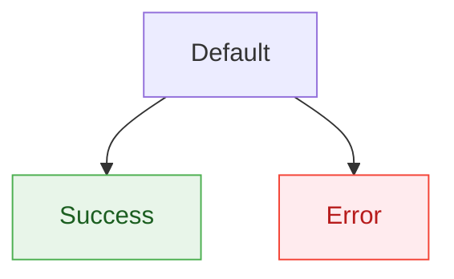

Use `classDef` + `:::` for reusable styles across multiple nodes:

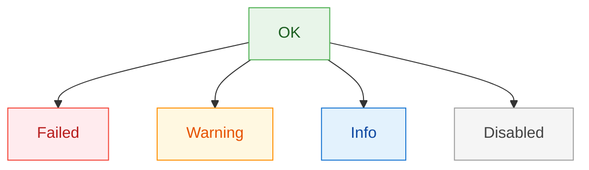

### Dark Mode Safety

**Always pin `color:` when using custom `fill:`.** Mermaid renderers in dark mode may flip text to white, making it invisible on light-colored fills.

```text
BAD:  style X fill:#e8f5e9,stroke:#4caf50
GOOD: style X fill:#e8f5e9,stroke:#4caf50,color:#1b5e20
```

**Recommended palette** (light fills with dark text, readable in both modes):

| Purpose  | Fill      | Stroke    | Color (text) |
|----------|-----------|-----------|-------------|
| Success  | `#e8f5e9` | `#4caf50` | `#1b5e20`   |
| Danger   | `#ffebee` | `#f44336` | `#b71c1c`   |
| Warning  | `#fff8e1` | `#ff8f00` | `#e65100`   |
| Info     | `#e3f2fd` | `#1976d2` | `#0d47a1`   |
| Muted    | `#f5f5f5` | `#9e9e9e` | `#424242`   |
| Purple   | `#f3e5f5` | `#9c27b0` | `#4a148c`   |

## Sequence Diagram

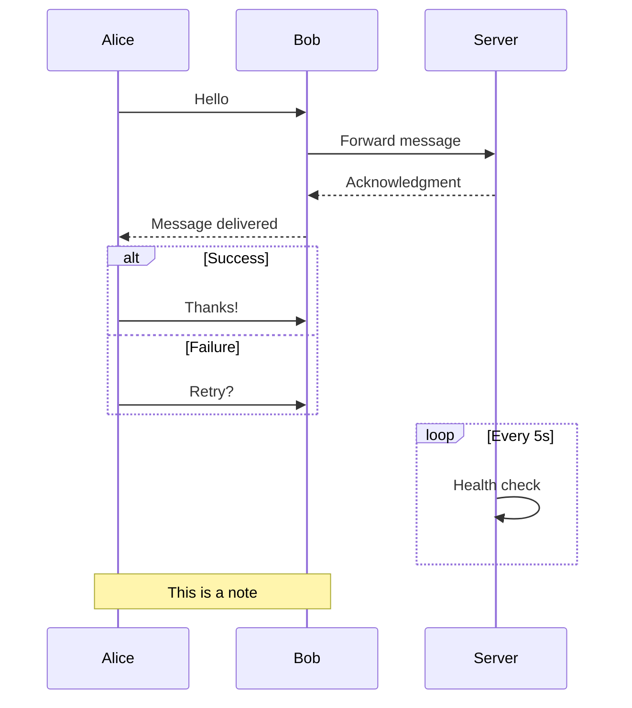

**Arrow types:**

| Syntax | Meaning              |
|--------|----------------------|
| `->>`  | Solid with arrow     |
| `-->>` | Dotted with arrow    |
| `->`   | Solid without arrow  |
| `-->`  | Dotted without arrow |
| `-x`   | Solid with cross     |
| `--x`  | Dotted with cross    |

## Entity Relationship

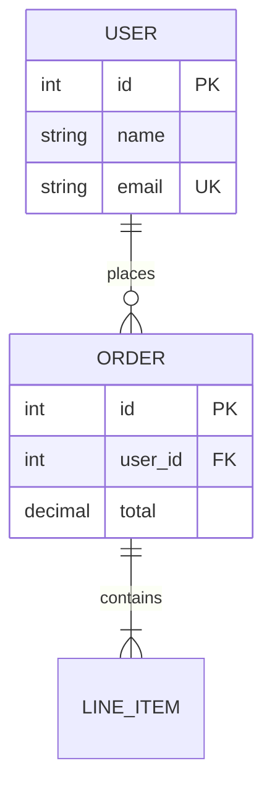

**Relationship types:**

| Syntax | Meaning      |
|--------|--------------|
| `\|\|` | Exactly one  |
| `o{`   | Zero or more |
| `\|{`  | One or more  |
| `o\|`  | Zero or one  |

## State Diagram

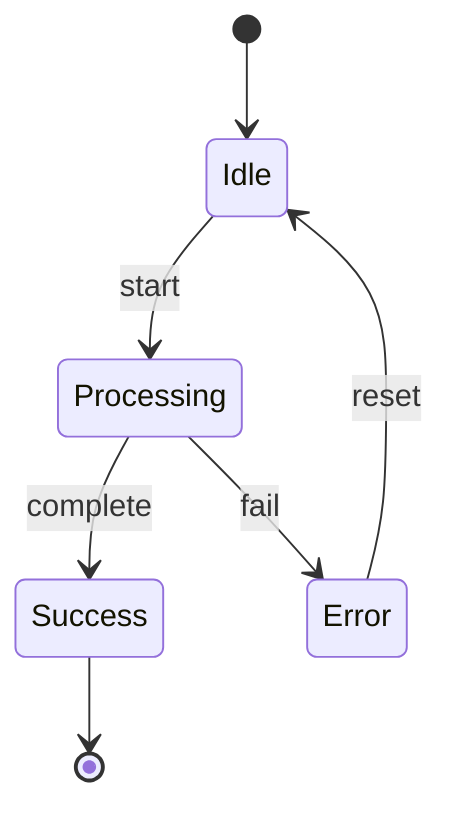

## Class Diagram

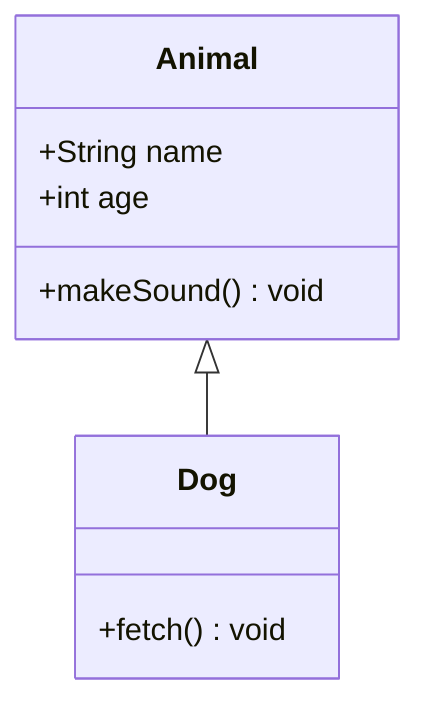

**Relationships:**

| Syntax  | Meaning     |
|---------|-------------|
| `<\|--` | Inheritance |
| `*--`   | Composition |
| `o--`   | Aggregation |
| `-->`   | Association |
| `..>`   | Dependency  |

## Mind Map

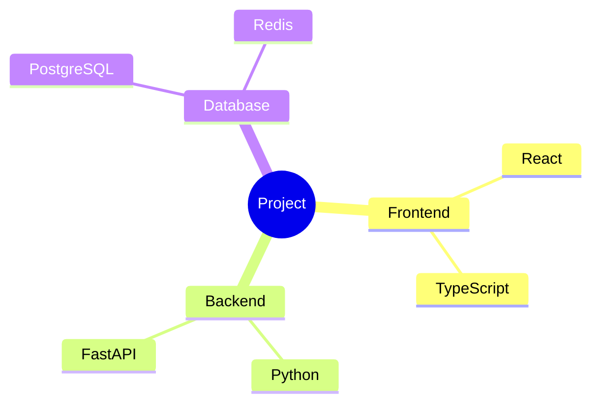

## Gantt Chart

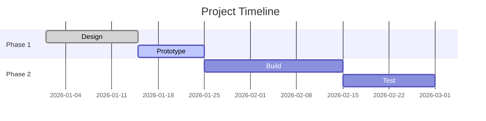

## Pie Chart

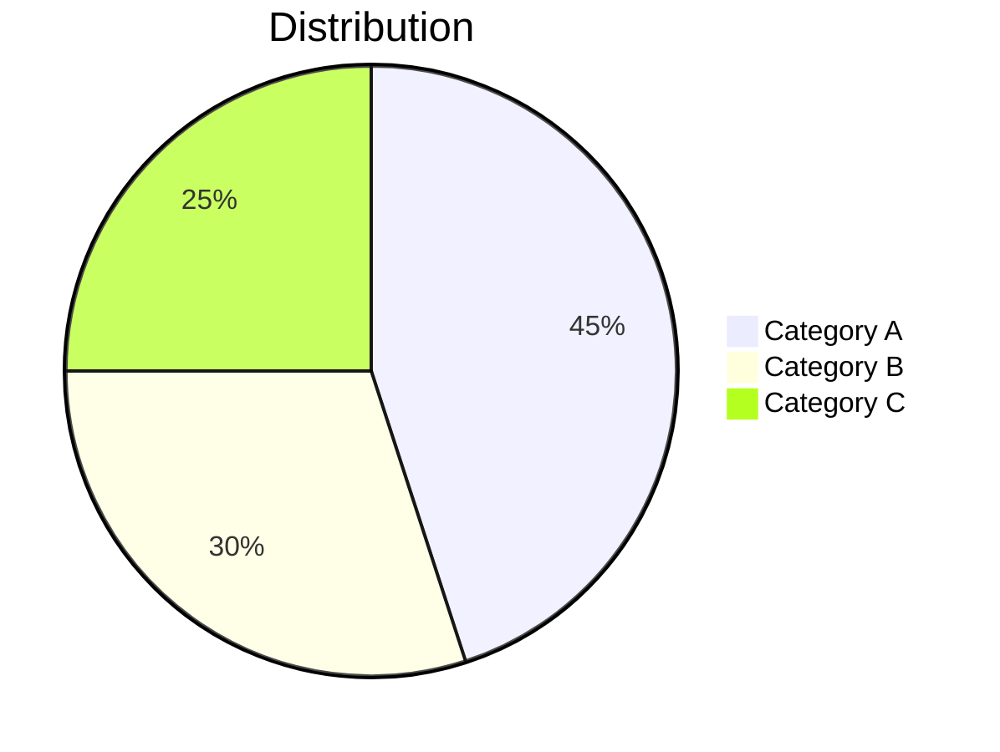

## C4 Diagram

Model software architecture using the C4 standard (Context, Container, Component):

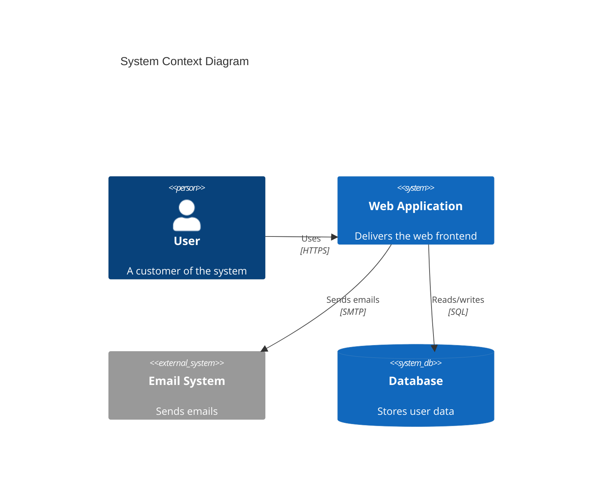

**C4 diagram types:** `C4Context`, `C4Container`, `C4Component`, `C4Deployment`

**C4 elements:**

| Function         | Description              |
|------------------|--------------------------|
| `Person`         | Human user               |
| `System`         | Internal system          |
| `System_Ext`     | External system          |
| `SystemDb`       | Database system          |
| `Container`      | App/service in a system  |
| `Component`      | Component in a container |
| `Rel`            | Relationship             |
| `Boundary`       | Grouping boundary        |

## Git Graph

Visualize branching strategies and merge history:

```mermaid
gitgraph
    commit
    commit
    branch develop
    checkout develop
    commit
    commit
    checkout main
    merge develop
    commit
    branch feature
    checkout feature
    commit
    checkout develop
    merge feature
    checkout main
    merge develop
```

**Options:** `commit id:"msg"`, `commit tag:"v1.0"`, `commit type: HIGHLIGHT`

**Commit types:** `NORMAL`, `REVERSE`, `HIGHLIGHT`

## Timeline

Show events along a time axis:

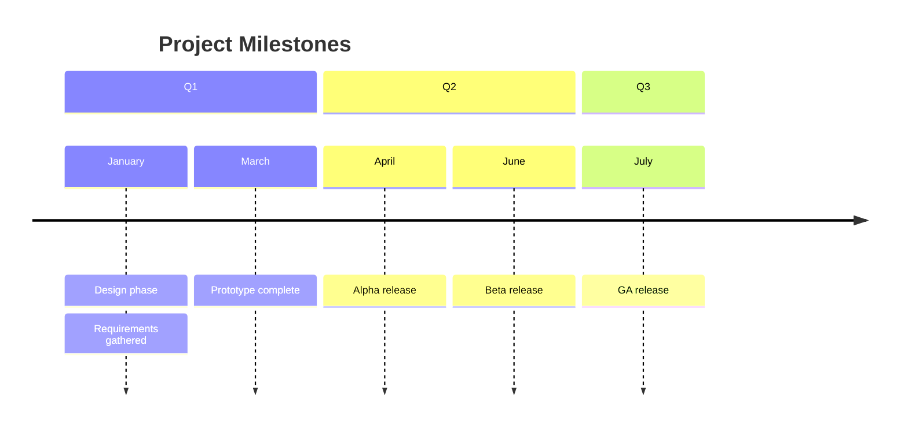

## Quadrant Chart

Priority/effort matrices and 2x2 analysis:

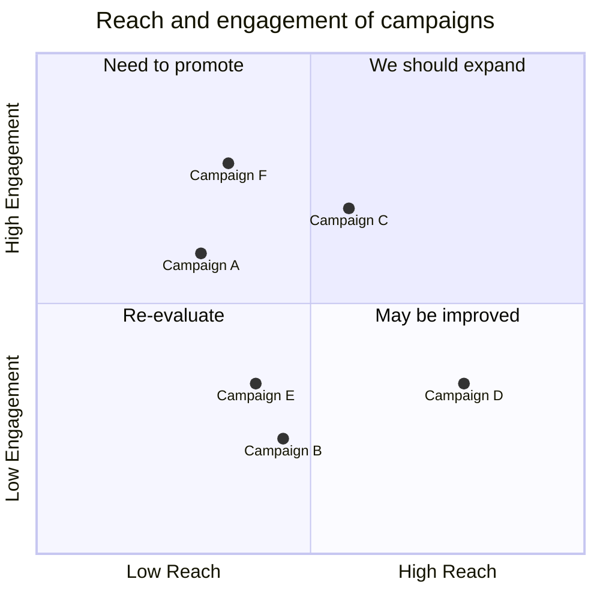

## XY Chart

Data visualization with bar and line marks:

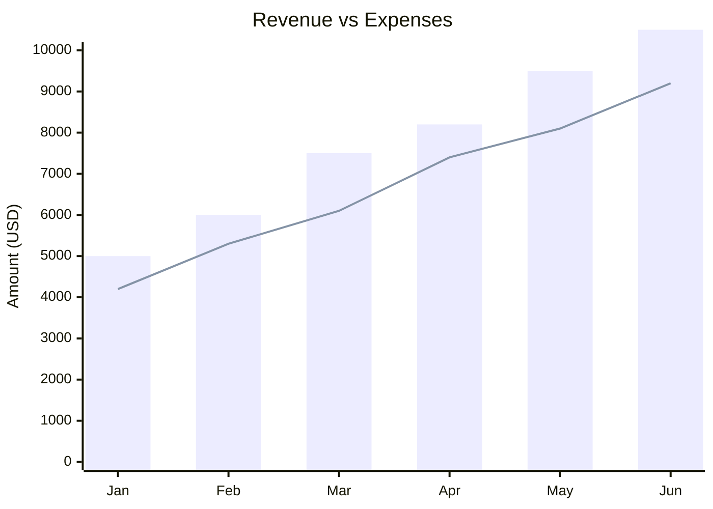

## Sankey Diagram

Visualize flow quantities between nodes:

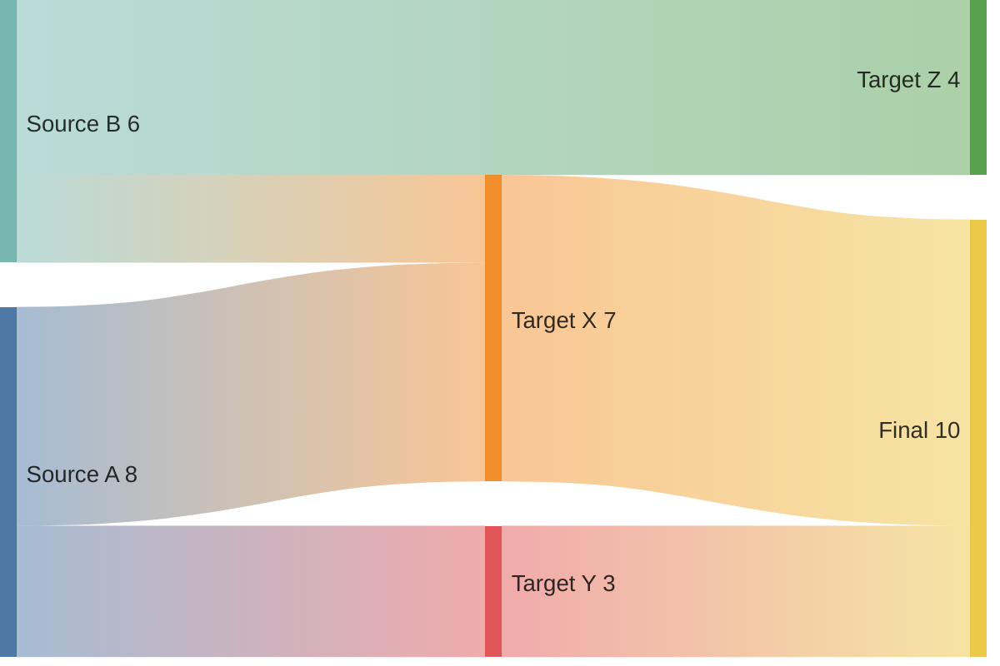

Format: `source,target,value` — one flow per line. Useful for budget flows, data pipelines, energy diagrams.

## Subgraphs and Nesting

Group nodes into named containers:

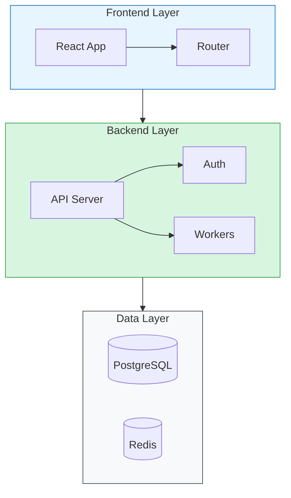

**Notes:**
- `direction` inside subgraphs works in `flowchart` but can be unreliable — test first
- Subgraph-to-subgraph edges (e.g., `Frontend --> Backend`) work and are cleaner than individual node edges
- Style subgraphs with `style SubgraphId fill:...,stroke:...`

## Theming and Init Directives

Control diagram appearance with `init` frontmatter:

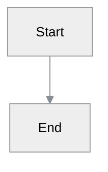

**Built-in themes:** `default`, `neutral`, `dark`, `forest`, `base`

**Key theme variables:**

| Variable              | Controls                        |
|-----------------------|---------------------------------|
| `primaryColor`        | Main node fill                  |
| `primaryTextColor`    | Main node text                  |
| `primaryBorderColor`  | Main node border                |
| `lineColor`           | Arrows and edges                |
| `secondaryColor`      | Secondary node fill             |
| `tertiaryColor`       | Tertiary node fill              |
| `fontSize`            | Global font size                |
| `fontFamily`          | Global font (quote if spaces)   |

## Common Pitfalls

1. **Special characters in labels** — Wrap in quotes: `A["Node with (parens)"]`. Unquoted parens/brackets break parsing.
2. **`direction LR` inside subgraphs** — Unreliable in `flowchart`. Use `block-beta` for grid layouts instead.
3. **Dark mode text** — Always pin `color:` when overriding `fill:`. See Dark Mode Safety above.
4. **Long labels truncate** — Mermaid clips text that overflows node boxes. Keep labels concise or use `<br/>` for line breaks: `A["Line one<br/>Line two"]`.
5. **Mermaid Chart MCP adds `<style>` tags** — The MCP tool may prepend CSS before `<svg>`. Strip the `<style>...</style>` block before using the raw SVG.
6. **Node ID collisions** — IDs like `end`, `start`, `class`, `style` are reserved words. Prefix them: `nodeEnd`, `stepStart`.
7. **Colon in labels** — Colons can be misinterpreted. Use quotes: `A["Key: Value"]`.
8. **Empty subgraphs** — A subgraph with no nodes causes a parse error. Always include at least one node.
