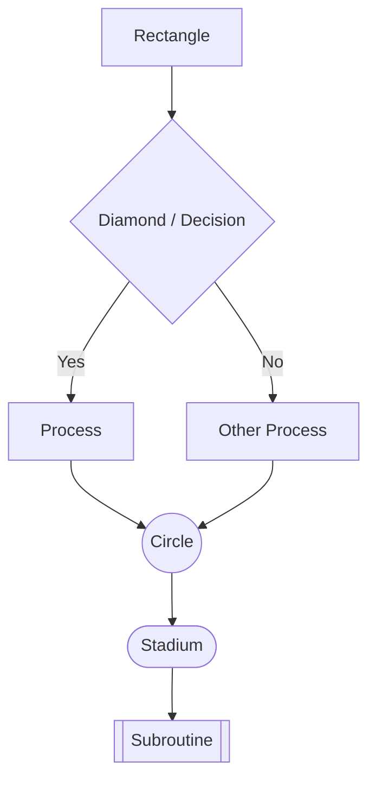
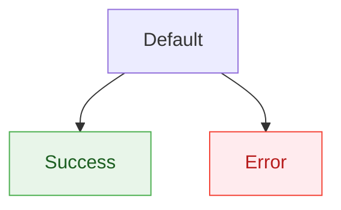
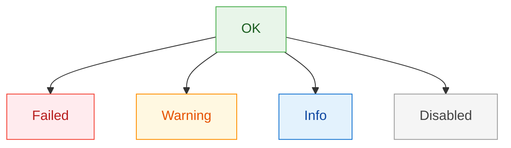
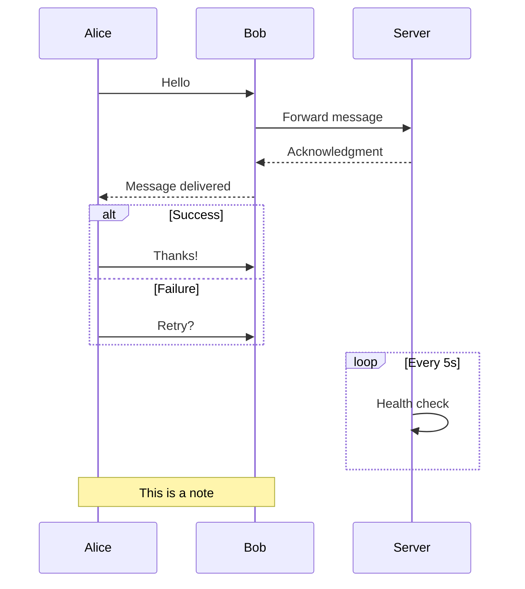
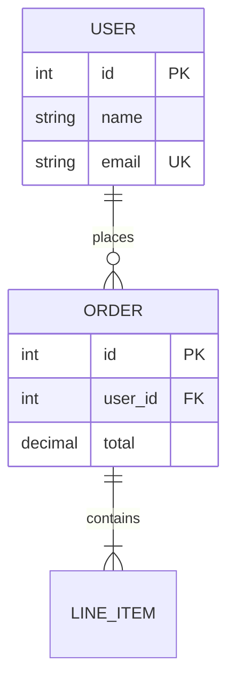
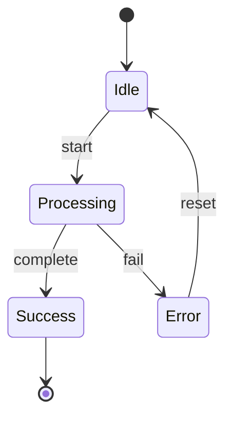
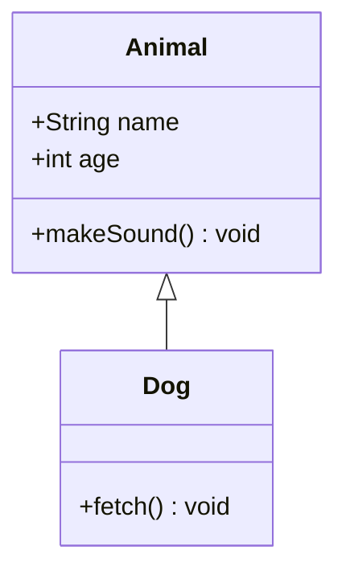
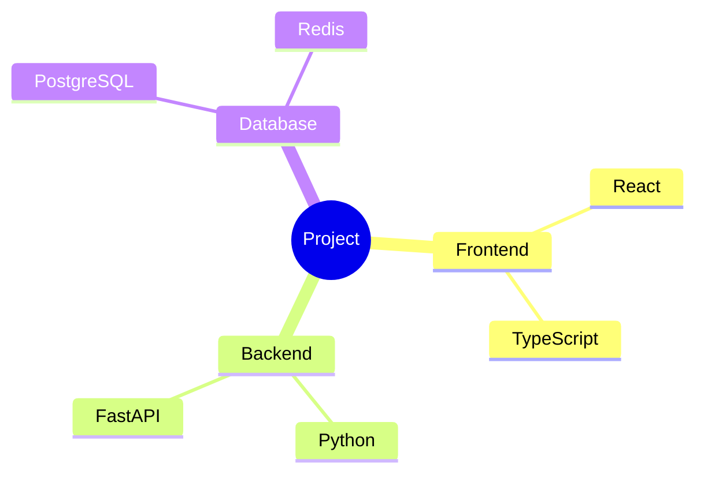
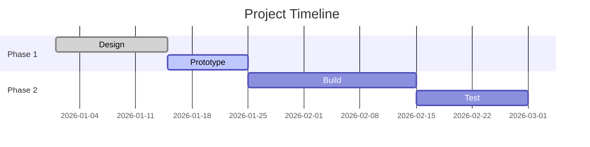
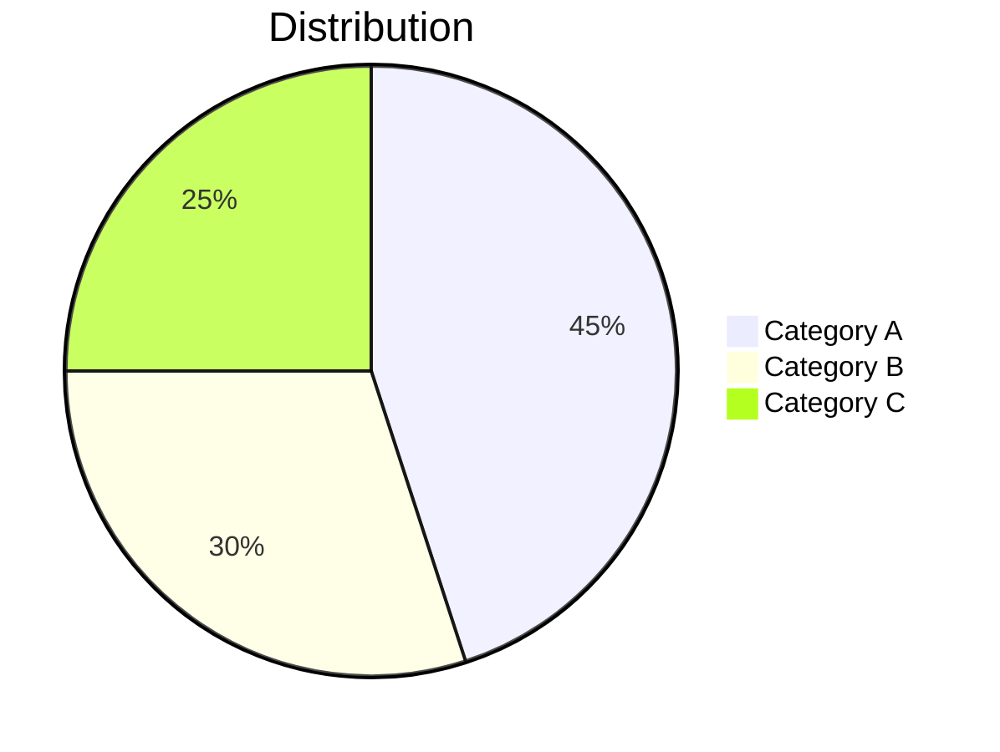

# Mermaid Syntax Guide

## Flowchart



**Direction:** `TD` (top-down), `LR` (left-right), `BT` (bottom-top), `RL` (right-left)

**Node shapes:**

| Syntax     | Shape              |
|------------|--------------------|
| `[text]`   | Rectangle          |
| `(text)`   | Rounded rectangle  |
| `{text}`   | Diamond (decision) |
| `((text))` | Circle             |
| `([text])` | Stadium            |
| `[[text]]` | Subroutine         |
| `[(text)]` | Cylinder           |
| `>text]`   | Asymmetric         |
| `{{text}}` | Hexagon            |

**Edge styles:**

| Syntax      | Style               |
|-------------|---------------------|
| `-->`       | Solid arrow         |
| `---`       | Solid line          |
| `-.->`       | Dotted arrow        |
| `==>`       | Thick arrow         |
| `--text-->` | Arrow with label    |

## Styling Nodes

Use `style` to override individual node appearance:



Use `classDef` + `:::` for reusable styles across multiple nodes:



### Dark Mode Safety

**Always pin `color:` when using custom `fill:`.** Mermaid renderers in dark mode may flip text to white, making it invisible on light-colored fills.

```text
BAD:  style X fill:#e8f5e9,stroke:#4caf50
GOOD: style X fill:#e8f5e9,stroke:#4caf50,color:#1b5e20
```

**Recommended palette** (light fills with dark text, readable in both modes):

| Purpose  | Fill      | Stroke    | Color (text) |
|----------|-----------|-----------|-------------|
| Success  | `#e8f5e9` | `#4caf50` | `#1b5e20`   |
| Danger   | `#ffebee` | `#f44336` | `#b71c1c`   |
| Warning  | `#fff8e1` | `#ff8f00` | `#e65100`   |
| Info     | `#e3f2fd` | `#1976d2` | `#0d47a1`   |
| Muted    | `#f5f5f5` | `#9e9e9e` | `#424242`   |
| Purple   | `#f3e5f5` | `#9c27b0` | `#4a148c`   |

## Sequence Diagram



**Arrow types:**

| Syntax | Meaning              |
|--------|----------------------|
| `->>`  | Solid with arrow     |
| `-->>` | Dotted with arrow    |
| `->`   | Solid without arrow  |
| `-->`  | Dotted without arrow |
| `-x`   | Solid with cross     |
| `--x`  | Dotted with cross    |

## Entity Relationship



**Relationship types:**

| Syntax | Meaning      |
|--------|--------------|
| `\|\|` | Exactly one  |
| `o{`   | Zero or more |
| `\|{`  | One or more  |
| `o\|`  | Zero or one  |

## State Diagram



## Class Diagram



**Relationships:**

| Syntax  | Meaning     |
|---------|-------------|
| `<\|--` | Inheritance |
| `*--`   | Composition |
| `o--`   | Aggregation |
| `-->`   | Association |
| `..>`   | Dependency  |

## Mind Map



## Gantt Chart



## Pie Chart


