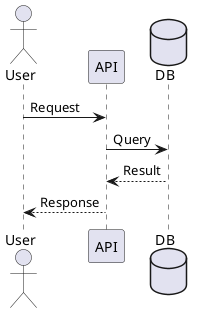
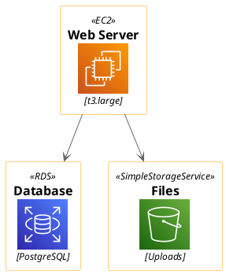
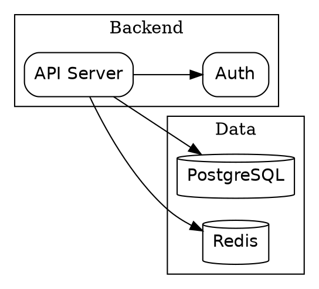

# Advanced Diagram Tools Reference

## PlantUML

**Install:** `brew install plantuml` (requires Java)

### Sequence Diagram



### Render Commands

```bash
# SVG output
plantuml -tsvg input.puml

# PNG output
plantuml -tpng input.puml

# ASCII art output (unique to PlantUML)
plantuml -utxt input.puml

# Pipe from stdin
cat input.puml | plantuml -pipe -tsvg > output.svg
```

### Icon Libraries

PlantUML includes stdlib with cloud provider icons:



Available icon sets: `<awslib/>`, `<azure/>`, `<kubernetes/>`, `<office/>`, `<tupadr3/>`

## Graphviz

**Install:** `brew install graphviz`

### DOT Language



### Render Commands

```bash
dot -Tsvg input.dot -o output.svg    # directed graph
neato -Tsvg input.dot -o output.svg  # undirected, spring model
fdp -Tsvg input.dot -o output.svg    # undirected, force-directed
circo -Tsvg input.dot -o output.svg  # circular layout
```

### Layout Engines

| Engine  | Best For                           |
|---------|------------------------------------|
| `dot`   | Directed graphs, hierarchies       |
| `neato` | Undirected graphs, moderate size   |
| `fdp`   | Large undirected graphs            |
| `sfdp`  | Very large graphs (1000+ nodes)    |
| `circo` | Circular layouts                   |
| `twopi` | Radial layouts                     |

## D2

**Install:** `brew install d2`

### Syntax

```d2
direction: right

frontend: Frontend {
    app: React App
    router: Router
    app -> router
}

backend: Backend {
    api: API Server
    api -> db: SQL
}

db: PostgreSQL {
    shape: cylinder
}

frontend.app -> backend.api: HTTPS
```

### Render Commands

```bash
d2 input.d2 output.svg              # default theme
d2 --theme 200 input.d2 output.svg  # dark theme
d2 --layout elk input.d2 output.svg # ELK layout engine
d2 --watch input.d2 output.svg      # live reload
```

## Vega-Lite

**Install:** `npm install -g vega-lite vega-cli` or `cargo install vl-convert`

### Bar Chart

```json
{
  "$schema": "https://vega.github.io/schema/vega-lite/v5.json",
  "data": {
    "values": [
      {"category": "A", "value": 28},
      {"category": "B", "value": 55},
      {"category": "C", "value": 43}
    ]
  },
  "mark": "bar",
  "encoding": {
    "x": {"field": "category", "type": "nominal"},
    "y": {"field": "value", "type": "quantitative"}
  }
}
```

### Render Commands

```bash
# Node-based
vl2svg -i spec.vl.json -o chart.svg
vl2png -i spec.vl.json -o chart.png

# Rust-based (faster)
vl-convert vl2svg -i spec.vl.json -o chart.svg
vl-convert vl2png -i spec.vl.json -o chart.png
```

## DBML

**Install:** `npm install -g @dbml/cli`

### Syntax

```dbml
Table users {
  id integer [pk, increment]
  username varchar [unique, not null]
  email varchar [unique]
}

Table posts {
  id integer [pk, increment]
  title varchar [not null]
  user_id integer [ref: > users.id]
}
```

Render via Kroki: `kroki convert schema.dbml -t svg`

## Markmap

**Install:** `npm install -g @markmap/cli`

Converts markdown headings/lists into interactive mind maps:

```bash
markmap input.md -o mindmap.html
markmap --watch input.md  # live reload
```

## Kroki (Unified API)

**Install:** `pip install kroki` or `docker run yuzutech/kroki`

Supports 25+ diagram types through one API:

```bash
kroki convert input.mmd -t svg -o output.svg     # Mermaid
kroki convert input.puml -t svg -o output.svg     # PlantUML
kroki convert input.dot -t svg -o output.svg      # Graphviz
kroki convert schema.dbml -t svg -o output.svg    # DBML
```

Or embed as image URL in markdown (no local rendering):

```text

```
